# 架构图

> 使用 [Mermaid](https://mermaid.js.org/) 绘制，GitHub/多数 Markdown 查看器可直接渲染。
> 交互式版本见 [architecture.html](./architecture.html)（由 [archify](https://github.com/tt-a1i/archify)
> 生成并通过 showcase 校验，源规格为 [architecture-diagram.json](./architecture-diagram.json)）。
> 与代码同步维护：模块增删时请更新此图。

## 总体架构

```mermaid
graph TB
    subgraph ENTRY["Flake 入口层"]
        FLAKE["flake.nix<br/>inputs：nixpkgs（南大镜像）/ nixpkgs-stable 26.05<br/>home-manager / noctalia / hyprland<br/>sops-nix / disko / catppuccin"]
        OUT["outputs/default.nix<br/>组装 nixosConfigurations（2 台主机）<br/>genSpecialArgs → specialArgs<br/>（inputs / mylib / myvars / pkgs-stable）"]
        LIB["mylib（lib/）<br/>nixosSystem 组装函数<br/>scanPaths 自动导入"]
        VARS["myvars（vars/）<br/>用户名 / 网络 / SSH 主机别名"]
    end

    subgraph SYSMOD["系统级模块（modules/nixos/）"]
        BASE["base/<br/>core（GRUB2 UEFI 引导）/ networking<br/>ssh（仅密钥）/ users（sops 密码 + root 锁定）<br/>sops（密钥解密）/ nix / packages / i18n"]
        DESKTOP["desktop.nix — 桌面入口<br/>Wayland + greetd/tuigreet<br/>（会话菜单，登录时切换合成器）"]
        HYPR["hyprland.nix<br/>programs.hyprland<br/>（hyprland flake 模块）"]
        DSK["desktop/<br/>thunar + gvfs / fonts / security<br/>misc / ssh"]
        SERVER["server/<br/>qemu-guest 客户机<br/>virtualisation（服务器工具包）"]
    end

    subgraph HOSTS["主机层（hosts/）"]
        HD["misty-desktop/<br/>disko.nix：ESP + swap + btrfs（@/@home/@nix）<br/>hardware-configuration.nix：内核模块"]
        HS["misty-server/<br/>disko.nix：ESP + swap + btrfs<br/>hardware-configuration.nix"]
    end

    subgraph HM["home-manager 用户层（home/）"]
        HENTRY_D["hosts/linux/misty-desktop.nix<br/>显式导入并启用 niri + hyprland"]
        HENTRY_S["hosts/linux/misty-server.nix<br/>仅 CLI"]
        CORE["base/core/<br/>zsh+starship / vim / git+gh+lazygit<br/>tools（eza/bat/fzf/zoxide/btop/yazi/rg/fd）"]
        GUIB["base/gui/<br/>Ghostty / Chrome（主）+Firefox（备）/ VS Code<br/>media（mpv 等）/ gtk / desktop-tools（共用工具唯一安装处）"]
        GUI_L["linux/gui/<br/>noctalia + fcitx5（共用）<br/>niri.nix / hyprland.nix（mkIf 条件启用）"]
    end

    subgraph SEC["密钥链路"]
        SOPS_YAML["secrets/secrets.yaml（sops 加密）<br/>misty/hashed_password<br/>ssh/authorized_keys"]
        SOPS_NIX["sops-nix → /run/secrets"]
        SOPS_KEY["age 私钥<br/>/var/lib/sops-nix/age/keys.txt"]
    end

    FLAKE --> OUT
    OUT --> LIB
    LIB --> VARS

    OUT -->|"nixosConfigurations.misty-desktop"| DSK2SYS
    DSK2SYS["misty-desktop 系统"]:::host
    DSK2SYS --> DESKTOP
    DSK2SYS --> HYPR
    DSK2SYS --> HD
    DSK2SYS --> BASE

    OUT -->|"nixosConfigurations.misty-server"| SRV2SYS
    SRV2SYS["misty-server 系统"]:::host
    SRV2SYS --> SERVER
    SRV2SYS --> HS
    SRV2SYS --> BASE

    OUT -->|"home-modules（经 home-manager 注入）"| HENTRY_D
    OUT --> HENTRY_S
    HENTRY_D --> CORE
    HENTRY_D --> GUIB
    HENTRY_D --> GUI_L
    HENTRY_S --> CORE

    DESKTOP -.->|"greetd 会话菜单"| NIRI_SESSION["Niri 会话"]:::session
    DESKTOP -.-> HYP_SESSION["Hyprland 会话"]:::session
    HYPR --> HYP_SESSION
    HD --> NIRI_SESSION

    SOPS_YAML --> SOPS_NIX
    SOPS_KEY --> SOPS_NIX
    SOPS_NIX --> BASE

    classDef host fill:#cba6f7,stroke:#6c5ce7,color:#1e1e2e
    classDef session fill:#a6e3a1,stroke:#40a02b,color:#1e1e2e
```

## 关键设计点

1. **三层分离**：`modules/nixos/base/`（全主机）→ `desktop/` / `server/`（按主机类型）→ `hosts/<名>/`（主机特定）。
2. **双合成器共存**：`misty-desktop` 同时安装 Niri 与 Hyprland，`modules.desktop.{niri,hyprland}.enable` 互独立，登录时通过 tuigreet 会话菜单切换，无需 rebuild。
3. **WM 模块显式导入**：`home/linux/gui/default.nix` 只装共用配置（Noctalia/fcitx5），WM 模块由主机 home 入口显式导入——新增 WM 遵循同一模式。
4. **磁盘声明式管理**：每台主机的分区布局由 `disko.nix` 定义（UEFI + GRUB2 引导，btrfs 子卷统一为 @/@home/@nix），`hardware-configuration.nix` 只保留内核模块。
5. **密钥全部走 sops-nix**：密码哈希在用户创建前解密（`neededForUsers`），SSH 公钥由 sshd 运行时读取（`authorizedKeys.files`）；root 密码已锁定，提权仅走 sudo。
